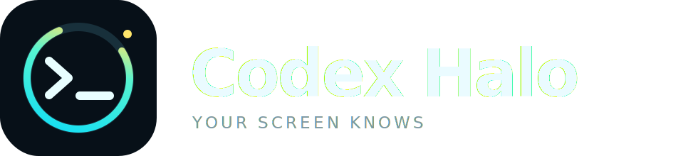
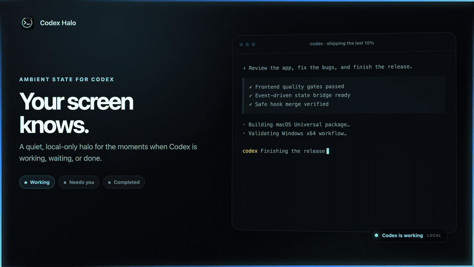

<p align="center">
  
</p>

<p align="center">
  <strong>给 Codex 装上呼吸灯（跑马灯）——无论在哪个窗口，都知道它是否正在处理你的指令。</strong><br>
  纯本地的屏幕四边状态灯：工作、等你、完成，一眼可见。
</p>

<p align="center">
  <a href="https://github.com/qcodingdev/codex-halo/releases/latest"></a>
  <a href="https://github.com/qcodingdev/codex-halo/releases/latest"></a>
  <a href="README.md"></a>
</p>

<p align="center">
  
</p>

## 不切窗口，也不会错过 Codex

| Codex 状态 | 屏幕光效 | 含义 |
|---|---|---|
| **工作中** | 青蓝流光 | 当前回合正在执行 |
| **需要你** | 琥珀呼吸 + 系统通知 | 正在等待权限决定 |
| **已完成** | 绿色顺时针扫光 | 当前回合结束 |
| **空闲** | 完全隐藏 | 无窗口、无动画 |

Halo 的透明窗口不会获取焦点，所有鼠标操作都会穿透到下面的应用。每块
已连接屏幕都有独立且同步的四边光效；空闲时所有光效窗口直接隐藏。Rust
优先使用系统文件事件，并以最多八个最近会话文件的 500ms 轻量检查兜底。

## 下载

| 平台 | 发布包 |
|---|---|
| macOS 11+（Intel + Apple Silicon） | [下载 macOS 版](https://github.com/qcodingdev/codex-halo/releases/latest) |
| Windows 10/11 | [下载 Windows 版](https://github.com/qcodingdev/codex-halo/releases/latest) |

首版暂未签名。macOS 第一次打开时，请右键 **Codex Halo.app**，选择
**打开**。macOS Intel 已完成真机验收；Apple Silicon 和 Windows 当前
只声明 CI 构建通过，不把它们包装成真机测试。macOS 下载包中的同一个
App 同时包含 Intel `x86_64` 与 Apple Silicon `arm64` 代码。

## 一分钟安装

### macOS

1. 下载并完整解压 `Codex-Halo-macOS-Universal-v0.1.8.zip`。
2. 运行 **Install Codex Halo.command**。
3. 首次启动：右键 **Codex Halo.app** → **打开**。
4. 正常使用 Codex；下一次任务开始时 Halo 会自动呼吸。
5. 点击菜单栏图标 → **Demo Mode**。

安装器只写用户目录：应用放到 `~/Applications`，不添加 Codex Hook，也不要求
安全确认。若旧版 Halo 留有自己标记的 Hook，安装器只会清理这些旧项。

### Windows

1. 下载并完整解压 `Codex-Halo-Windows-x64-v0.1.8.zip`。
2. 使用 PowerShell 运行 `Install-Codex-Halo.ps1`。
3. 正常使用 Codex；不需要配置文件、Hook 或安全确认。
4. 点击托盘图标 → **Demo Mode**。

不需要管理员权限，也不会写入系统级 `Program Files`。

## 三套主题

- **Cyber Blue**：冷色青蓝流光、琥珀提醒、亮绿完成。
- **Sakura**：更温暖柔和的粉紫光效。
- **Minimal**：只保留顶部细条，适合低干扰场景。

主题、启停、Demo Mode、开机启动和日志入口都在原生托盘菜单中，设置
会跨启动保存。

## 工作原理

```text
Codex Desktop 本地会话生命周期记录
       │  只识别 task_started / task_complete
       ▼
原生文件事件 + 最近会话轻量检查
       ▼
Rust 状态机 ──Tauri 事件──▶ 鼠标穿透的 React/CSS 光效层
```

Halo 只观察 Codex Desktop 本地的 `task_started` 和 `task_complete` 记录，
不会解析、存储或记录 Prompt/工具负载；遗留状态会按超时自动回到空闲。

没有 HTTP 服务、WebSocket、云端、数据库、更新下载器、账号或埋点。

## 隐私是结构约束

只读取本地生命周期记录类型，不会保存 Prompt、工具参数、回复、源码、路径、
Token 或环境变量。详见
[隐私说明](docs/PRIVACY.md)与[安全策略](SECURITY.md)。

## 性能

- 原生文件事件为主，仅对最多八个最近会话文件做 500ms 轻量检查；
- 空闲时隐藏窗口、停止 CSS 动画；
- 光效以 transform/opacity 动画为主；
- 单个可取消的超时工作线程；
- 生产 JS 197.61 KB，gzip 62.21 KB。

空闲时光效窗口隐藏且不运行 CSS 动画；兜底检查只读取有限数量文件的元数据，
不会重复扫描历史会话。Apple Silicon 与 Windows 目前仍是 CI 构建验证。

## 构建与贡献

```bash
pnpm install
pnpm check
cargo test --manifest-path src-tauri/Cargo.toml
pnpm tauri dev
```

详见[架构](docs/ARCHITECTURE.md)、[发布流程](docs/RELEASE.md)与
[贡献指南](CONTRIBUTING.md)。

## 干净卸载

运行发布包中的卸载器。它只从“当前配置”删除 Halo 自己的 Hook，因此
安装之后由用户新增的其他 Hook 不会丢失。应用和开机启动项会删除；配置
和日志需要显式选择清理（macOS `--purge`，Windows `-Purge`）。

v0.1 支持多显示器，保持未签名、纯本地。签名/公证、DMG/MSI 和更多
主题属于后续版本。

Codex Halo 是独立社区项目，与 OpenAI 无附属或背书关系。“Codex”仅用于
说明兼容对象。

## License

[MIT](LICENSE)
